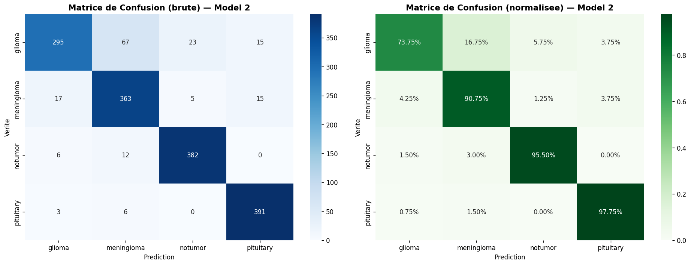
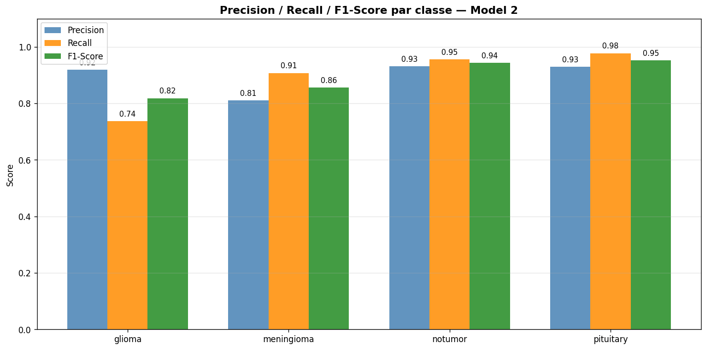
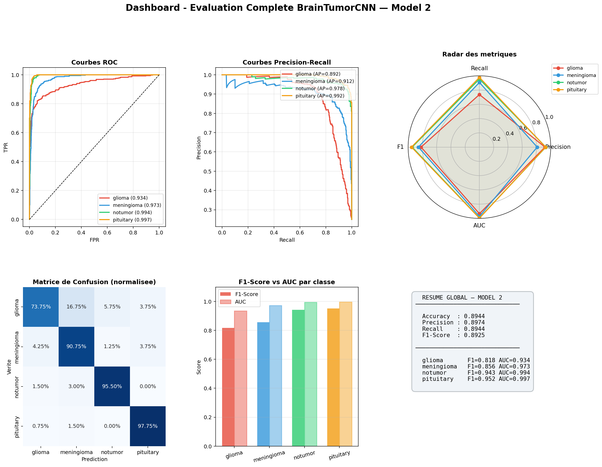
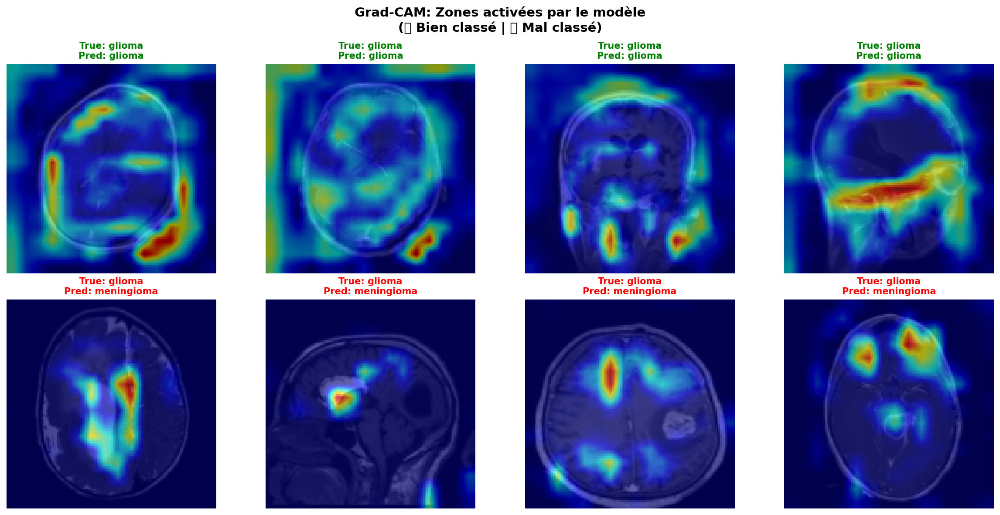
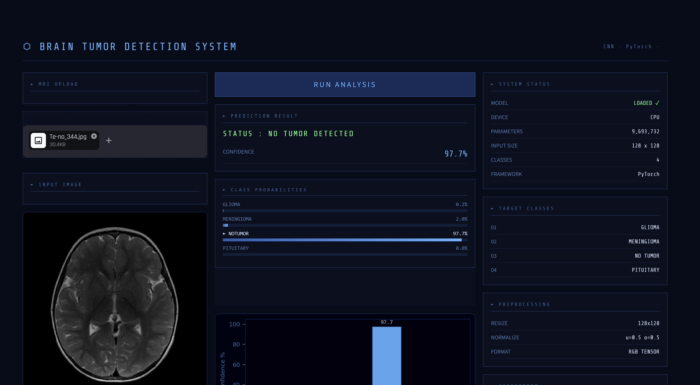

# 🧠 Brain Tumor Classification System

A deep learning-based brain tumor detection and classification system using Convolutional Neural Networks (CNN) with PyTorch. This project classifies MRI brain scans into four categories: Glioma, Meningioma, Pituitary, and No Tumor.


---

## 🚀 Live Demo

**Try the application live here:** [Brain Tumor Detection App](https://deep-learning-based-brain-tumour-detection-and-classification.streamlit.app/)

---

## 📋 Table of Contents

1. [Project Overview](#-project-overview)
2. [Dataset](#-dataset)
3. [Model Architecture](#-model-architecture)
4. [Installation](#-installation)
5. [Usage](#-usage)
6. [Results](#-results)
7. [Web Application](#-web-application)
8. [Project Structure](#-project-structure)
9. [License](#-license)

---

## 🖼️ Project Overview

This project implements a computer vision system for automatic brain tumor detection and classification from MRI scans. The system uses:

- **Custom CNN Architecture**: A deep convolutional neural network designed specifically for medical image classification
- **Advanced Data Augmentation**: Targeted augmentation techniques to improve model performance on hard-to-classify cases
- **Comprehensive Evaluation**: Multiple metrics including confusion matrices, ROC curves, and precision-recall analysis
- **Model Interpretability**: Grad-CAM visualization to understand model decisions
- **Web Interface**: User-friendly Streamlit application for easy inference

### Target Classes

| Class          | Description                            |
| -------------- | -------------------------------------- |
| **Glioma**     | Glioma tumors develop from glial cells |
| **Meningioma** | Tumors of the meninges (brain lining)  |
| **Pituitary**  | Tumors of the pituitary gland          |
| **No Tumor**   | Healthy brain (no tumor detected)      |

---

## 📊 Dataset

The dataset consists of MRI brain scan images organized in the following structure:

```
data/
├── Training/
│   ├── glioma/          (~800+ images)
│   ├── meningioma/      (~800+ images)
│   ├── notumor/        (~800+ images)
│   └── pituitary/     (~800+ images)
└── Testing/
    ├── glioma/
    ├── meningioma/
    ├── notumor/
    └── pituitary/
```

### Data Statistics

- **Total Training Images**: ~3,200+ images
- **Total Testing Images**: ~400+ images
- **Image Format**: JPG (128x128 pixels, RGB)
- **Classes**: 4 (balanced dataset)

---

## 🧠 Model Architecture

The system uses a custom CNN architecture optimized for brain tumor classification:

```
BrainTumorCNN
├── Feature Extractor (Convolutional Blocks)
│   ├── Block 1: Conv2d(3→32) → ReLU → Conv2d(32→32) → ReLU → MaxPool2d
│   ├── Block 2: Conv2d(32→64) → ReLU → Conv2d(64→64) → ReLU → MaxPool2d
│   ├── Block 3: Conv2d(64→128) → ReLU → Conv2d(128→128) → ReLU → MaxPool2d
│   └── Block 4: Conv2d(128→256) → ReLU → Conv2d(256→256) → ReLU → MaxPool2d
└── Classifier (Fully Connected)
    ├── Linear(256×8×8 → 512) → ReLU → Dropout(0.5)
    ├── Linear(512 → 256) → ReLU → Dropout(0.5)
    └── Linear(256 → 4)
```

### Model Specifications

| Specification    | Value          |
| ---------------- | -------------- |
| Input Size       | 128 × 128 × 3  |
| Total Parameters | ~2.5M          |
| Dropout Rate     | 0.5            |
| Activation       | ReLU (inplace) |
| Optimizer        | Adam           |
| Learning Rate    | 0.001          |
| Batch Size       | 32             |

---

## ⚙️ Installation

### Prerequisites

- Python 3.8+
- CUDA-capable GPU (optional, for faster training)

### Install Dependencies

```bash
# Clone the repository
git clone https://github.com/yourusername/Brain_Segmentation.git
cd Brain_Segmentation

# Create virtual environment (recommended)
python -m venv venv
source venv/bin/activate  # On Windows: venv\Scripts\activate

# Install requirements
pip install -r requirements.txt
```

### Required Packages

```
matplotlib    # Plotting and visualization
numpy         # Numerical operations
pillow        # Image processing
torch         # Deep learning framework
torchvision   # Computer vision utilities
streamlit     # Web application framework
typing_extensions  # Type hints
```

---

## 🚀 Usage

### Training the Model

#### Option 1: Basic Training (main.ipynb)

```bash
# Run the Jupyter notebook
jupyter notebook main.ipynb
# Or use VS Code to run the cells
```

#### Option 2: Enhanced Training with Targeted Augmentations (train2.py)

```bash
python train2.py
```

This version includes:

- Targeted data augmentation for hard-to-classify classes (glioma, meningioma)
- Weighted loss function for class imbalance
- Learning rate scheduling (ReduceLROnPlateau)
- 25 epochs with advanced augmentations

### Evaluating the Model

```bash
# Comprehensive evaluation with all metrics
python evaluate_model2.py
```

_generates:_

- Confusion matrices (raw & normalized)
- Precision/Recall/F1 per class
- ROC curves
- Precision-Recall curves
- Probability distributions
- Dashboard summary

### Model Interpretability

```bash
# Grad-CAM analysis
python explain.py
```

_generates:_

- Grad-CAM activation maps
- Analysis of hard cases (Glioma ↔ Meningioma confusion)

### Running the Web Application

```bash
# Start the Streamlit app
streamlit run app.py
```

The app will open in your browser at `http://localhost:8501`

---

## 📈 Results

### Model Performance Comparison

| Metric        | Before (model.pth) | After (model2.pth) | Improvement |
| ------------- | ------------------ | ------------------ | ----------- |
| **Accuracy**  | 75.31%             | **89.44%**         | **+14.13%** |
| **Precision** | 0.755              | **0.897**          | +0.142      |
| **Recall**    | 0.753              | **0.894**          | +0.141      |
| **F1-Score**  | 0.737              | **0.893**          | +0.156      |

### Per-Class Performance (After Training)

| Class          | Recall | F1-Score | Improvement |
| -------------- | ------ | -------- | ----------- |
| **Glioma**     | 73.8%  | 0.818    | +20.3%      |
| **Meningioma** | 90.7%  | 0.856    | +38.2%      |
| **No Tumor**   | -      | 0.943    | +0.110      |
| **Pituitary**  | -      | 0.952    | +0.073      |

### Key Achievements

✅ **+14.13% accuracy improvement** (75.31% → 89.44%)  
✅ **+38.2% recall improvement** on Meningioma (hardest class)  
✅ **+20.3% recall improvement** on Glioma  
✅ **AUC > 0.97** for all classes  
✅ **Robust model** with targeted augmentation strategy

### Generated Visualizations

All result images are saved in the `results/` folder:

```
results/
├── training1/
│   ├── fig2_metrics_per_class.png
│   ├── fig3_roc_per_class.png
│   ├── fig4_pr_per_class.png
│   ├── fig5_prob_distributions.png
│   └── fig6_dashboard.png
└── training2/
    ├── fig1_confusion_matrix.png
    ├── fig2_1_confusion_matrix.png
    ├── fig2_2_metrics_per_class.png
    ├── fig2_3_roc_per_class.png
    ├── fig2_4_pr_per_class.png
    ├── fig2_5_prob_distributions.png
    ├── fig2_6_dashboard.png
    ├── fig7_gradcam_analysis.png
    ├── fig8_hard_cases_glioma_meningioma.png
    └── training_curves_augmented.png
```

### Sample Results Visualization









---

## 🌐 Web Application

The Streamlit web application provides an intuitive interface for brain tumor prediction:

### Features

- **Image Upload**: Drag & drop or browse for MRI scans
- **Real-time Prediction**: Instant classification results
- **Confidence Scores**: Detailed probability for each class
- **Risk Assessment**: Visual risk level indicator
- **Model Information**: Display of model parameters and status

### How to Use

1. Open the application in your browser
2. Upload an MRI brain scan image (JPG, JPEG, or PNG)
3. Click "RUN ANALYSIS"
4. View the prediction results and confidence scores

### Screenshot



---

## 📁 Project Structure

```
Brain_Segmentation/
├── data/                      # Dataset directory
│   ├── Training/
│   └── Testing/
├── results/                   # Evaluation results
│   ├── training1/
│   └── training2/
├── app.py                     # Streamlit web application
├── train.py                   # Basic training script
├── train2.py                  # Enhanced training with augmentations
├── main.ipynb                 # Jupyter notebook for training
├── evaluate_model1.py        # Model 1 evaluation
├── evaluate_model2.py         # Model 2 evaluation
├── explain.py                # Grad-CAM interpretability
├── requirements.txt         # Python dependencies
├── model.pth                 # Trained model (basic)
├── model2.pth                # Trained model (enhanced)
└── README.md                # This file
```

---

## 🔧 Technical Details

### Data Preprocessing

```python
# Training transforms
train_tf = transforms.Compose([
    transforms.Resize((128, 128)),
    transforms.RandomHorizontalFlip(),
    transforms.RandomRotation(15),
    transforms.ColorJitter(brightness=0.2, contrast=0.2),
    transforms.ToTensor(),
    transforms.Normalize([0.5, 0.5, 0.5], [0.5, 0.5, 0.5])
])

# Evaluation transforms
eval_tf = transforms.Compose([
    transforms.Resize((128, 128)),
    transforms.ToTensor(),
    transforms.Normalize([0.5, 0.5, 0.5], [0.5, 0.5, 0.5])
])
```

### Advanced Augmentations (train2.py)

The enhanced training uses Albumentations for targeted augmentation:

- **Heavy Augmentations** (Glioma, Meningioma):
  - HorizontalFlip
  - RandomRotate90
  - ShiftScaleRotate
  - RandomBrightnessContrast
  - GaussNoise
  - ElasticTransform
  - CoarseDropout
  - CLAHE

- **Light Augmentations** (No Tumor, Pituitary):
  - HorizontalFlip
  - RandomRotate90

---

## 📝 License

This project is for educational and research purposes. The dataset used is from the [Brain Tumor Classification Dataset](https://www.kaggle.com/datasets/sartajbhuvaji/brain-tumor-classification-mri) on Kaggle.

---

## 🙏 Acknowledgments

- Dataset: [Brain Tumor Classification MRI](https://www.kaggle.com/datasets/sartajbhuvaji/brain-tumor-classification-mri)
- Framework: [PyTorch](https://pytorch.org)
- Web App: [Streamlit](https://streamlit.io)

---

## 📧 Contact

For questions or suggestions, please open an issue on GitHub.

---

<div align="center">

**Made with ❤️ for Medical AI**

</div>
